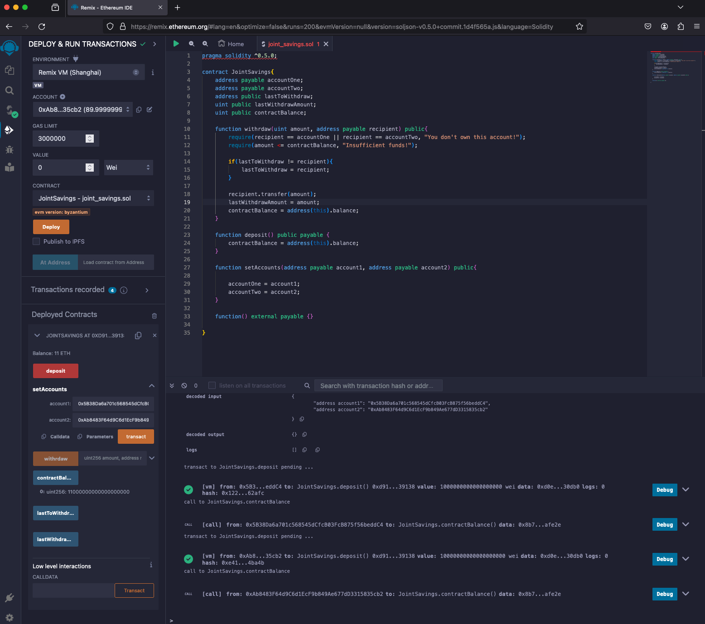

# Unit 20 - "Joint Savings Account"

## Interact with the Deployed Smart Contract

1. Set accounts.

2. Test the deposit functionality of your smart contract by sending the following amounts of ether. After each transaction, use the `contractBalance` function to verify that the funds were added to your contract:

    * Transaction 1: Send 1 ether as wei.

    * Transaction 2: Send 10 ether as wei.

    * Transaction 3: Send 5 ether.

 

3. Once you’ve successfully deposited funds into your contract, test the contract’s withdrawal functionality by withdrawing 5 ether into `accountOne` and 10 ether into `accountTwo`. After each transaction, use the `contractBalance` function to verify that the funds were withdrawn from your contract. Also, use the `lastToWithdraw` and `lastWithdrawAmount` functions to verify that the address and amount were correct.

    * Withdraw 5 ether into account 1.
    
    * Withdraw 10 ether into account 2.
    

